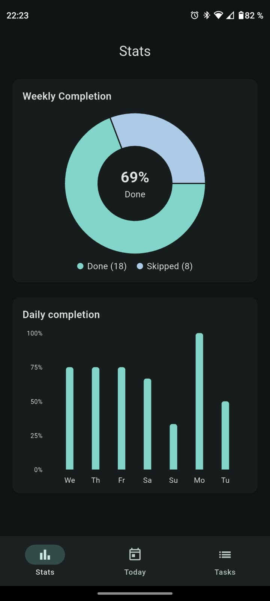
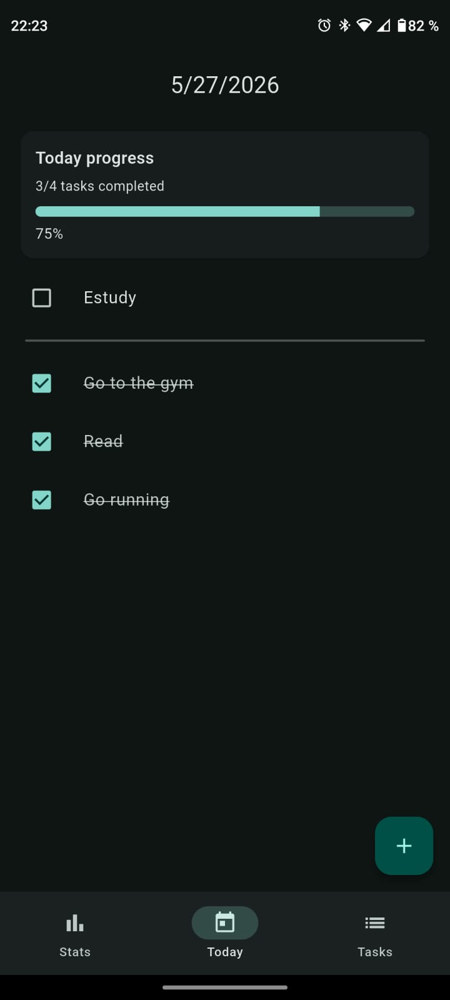
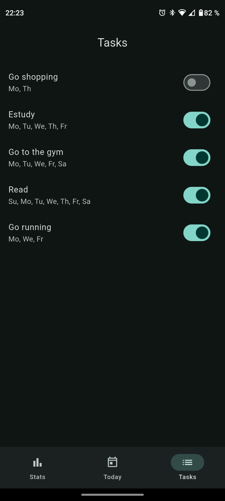

# Daily Tasks

A Flutter app to manage recurring daily tasks and track your completion history.

## Features

- **Today view** — see only the tasks scheduled for the current day. Check them off as you complete them.
- **Task manager** — create, edit, and delete tasks. Assign them to specific days of the week and toggle them active/inactive.
- **Stats view** — review your completion history.

## Screenshots

  
  &nbsp;&nbsp;&nbsp;
  
  &nbsp;&nbsp;&nbsp;
  

## Tech stack

- Flutter (Dart)
- SQLite via `sqflite`
- Fl Chart
- Supports Android and iOS
